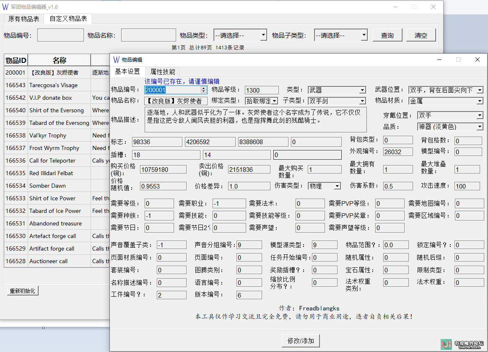
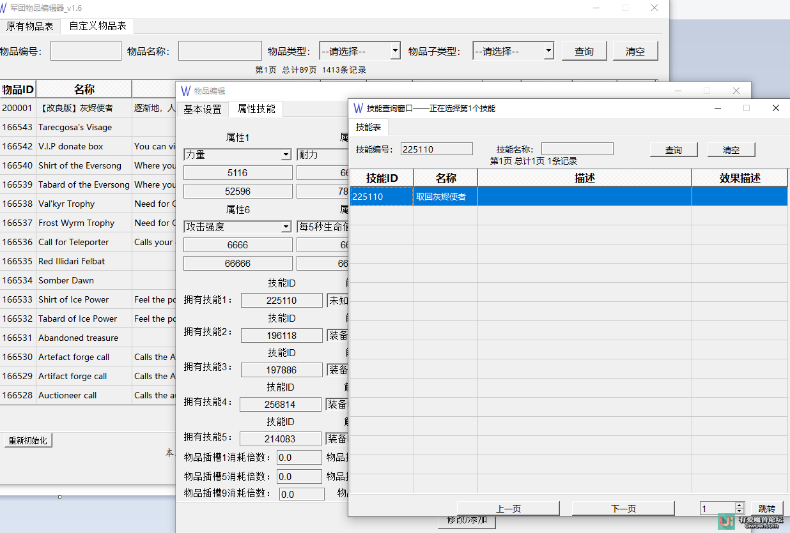
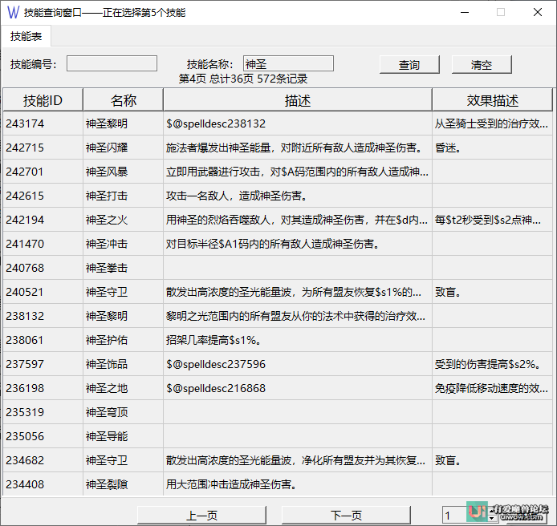

## 军团物品编辑器

下载地址：

链接1：[有爱论坛发布地址](http://uiwow.com/thread-9609-1-1.html)

链接2：[百度网盘下载](https://pan.baidu.com/s/1RykeMm78QvwR1dxCmICYLg) 提取码：1234

链接3: [Github-release-v1.6](https://github.com/freadblangks/LegionItemEditor/releases/download/v1.6/_v1.6.zip)

基于PyQt5的军团物品编辑器

> 第一个版本，虽然测试过但仍可能存在bug，欢迎指正

> 功能本身不难，但是细节很多，翻译或注释可能不准确，毕竟资料少

> 支持所有735端的物品编辑，测试过Trinitycore，OpenLCore，Uwow，Cwcore

> 软件测试环境Win10，分辨率1920 *1080，最低分辨率1366 *768，其他分辨率可能会出现问题

另外
---
目前不打算开源，主要是代码太凌乱，一边学一边写，有时候仅仅为了实现功能

使用说明：
---
> 1、下载release压缩包并解压

> 2、运行你的军团mysql

> 3、运行"军团物品编辑器.exe"，对照worldserver.conf填写配置

>   （注意：数据库必须为hotfix库）

> 4、弹出的对话框全部点Yes

>   （会创建四个表item_template_26972,item_template,item_effect，spell）

	sql读取方式有问题，分割会被注释影响，所以不建议将自己创建sql替换原有sql

> 5、查询你要修改的物品，或者查询你想要以此为模板添加的物品

>   左侧标签为原有物品表，右侧为自定义物品表

>   注意只提供了三种查询方式：

>   	a编号

>   	b名称

>   	c类别

> 		优先级a>b>c

> 6、双击打开编辑界面，编辑完成后点击下方的"修改/添加"按钮

> 7、删除自定义物品的方式：

>   	支持多选

>   	a选中，点击鼠标右键，选择"删除选中物品"

>   	b选中，点击键盘Delete键

>   	注意：删除目前未添加恢复功能，请谨慎操作

感谢
---
本项目是站在巨人的肩膀上

**欢迎star、fork**

未完成的功能（后续版本可能会完成的功能）
---

* 可能会添加技能查询功能

* 可能会做多语言设置

* 可能会加更多的注释

* 可能会加预览功能

截图
---

历史版本
---
[v1.0]

赞赏
---

